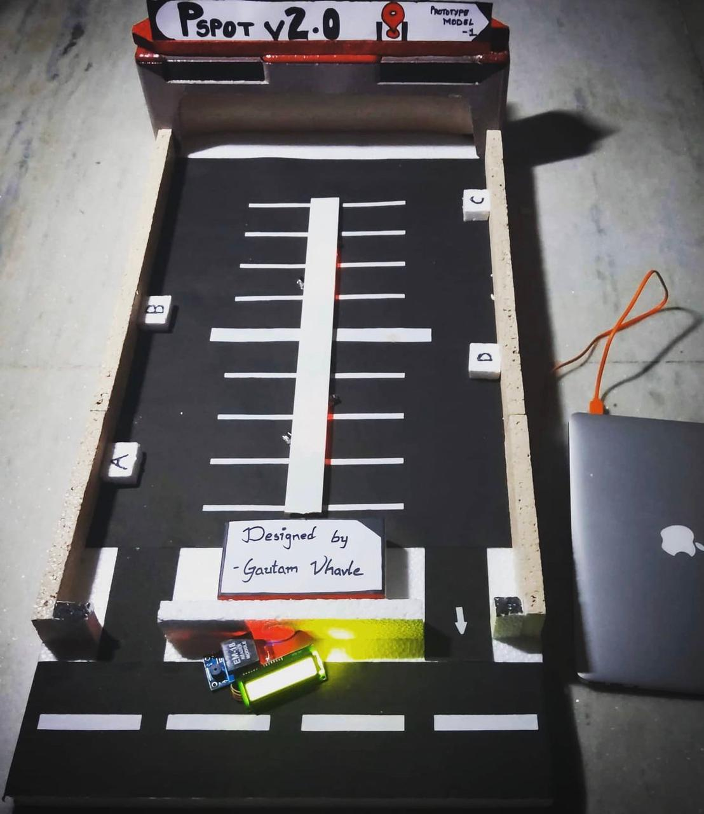

# The Parking Spot

| Member | LinkedIn | Devfolio |
|-|-|-|
| Gautam Vhavle | https://www.linkedin.com/in/gautamvhavle | https://devfolio.co/@GautamVhavle |
| Suhaas Borra | https://www.linkedin.com/in/suhaasborra | https://devfolio.co/@Suhaas_borra |

[Website](https://gautamvhavle.wixsite.com/website)  
[GitHub (Project)](https://github.com/Suhaas-code/HACKNITRR-PEACE)  

1. Open `TheParkingSpot.pdf` to learn about our Project 
2. Run `sketch_pSpot.ino` on arduino to start the Project
3. Install `TheParkingSpot.apk` on an android device to test our Working App (WebApp)
4. Snapshots of working model : `WorkingPrototype.jpeg`

### Version 1.1

**What's working**  
- The Web-app is completely functional

**Expect in later versions**  
- Notification API to work on live feed from the arduino board, this will let the app to show the parking location of your vehicle  
- Augmented Reality based navigation, minimal animated interface to show arrows, probably based on Material You theming engine (_Android 12_)

### Some Snapshots

